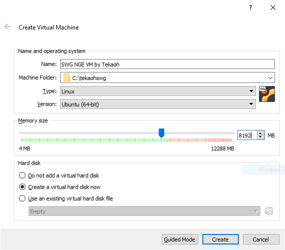
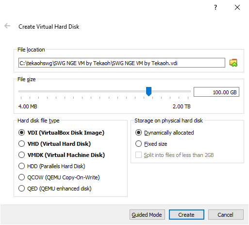
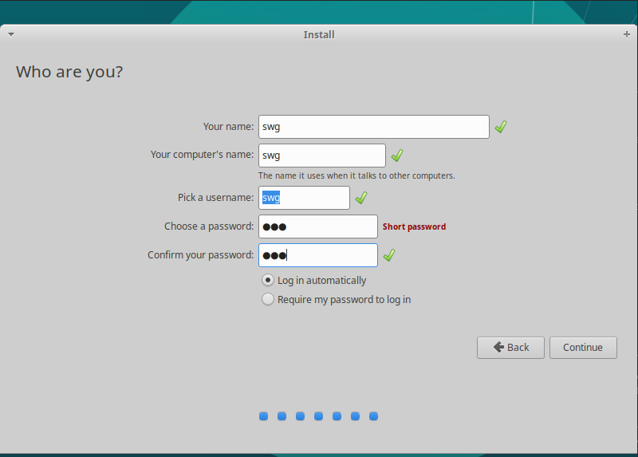
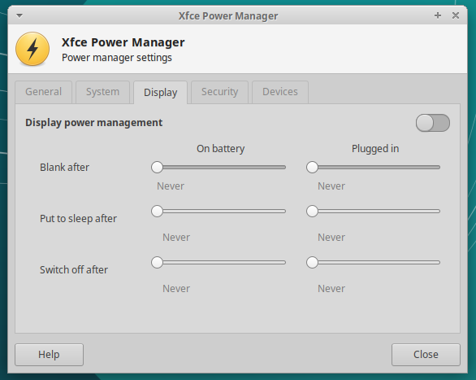

## Build a New SWG Server

This guide will help you build a new SWG Server VM from scratch. I recommend following this guide's every detail at least once before attempting to build a server with different settings or anything.

### Prerequisites

You need to have [Oracle VirtualBox](https://www.virtualbox.org/) installed on your host machine before you begin.

You should also download the latest installation media for Xubuntu 18.04 from [here](http://mirror.us.leaseweb.net/ubuntu-cdimage/xubuntu/releases/18.04/release/) (`amd64.iso` is the one you want). This guide uses Xubuntu because I like it. Ubuntu is popular and I prefer Xfce.

### Prepare your VM for installation

In VirtualBox, Select `Machine -> New...`. You will be prompted with a window to begin creating your VM. Enter Expert Mode if you're not already there. Then give your VM a name, choose where it will be saved, and select `Type: Linux` and `Version: Ubuntu (64-bit)`. Choose how much RAM you will give your VM and be sure that you have the `Create a virtual hard disk now` option selected.



>A note on memory size: To run the _entire_ game, you will need at least 16 GB of RAM in your VM. If you don't have that much, just choose an amount as high as you can go while still leaving enough for the host to be comfortable running a SWG client. In this example, my host has only 12 GB of RAM, so I will give 8G B to the VM and keep 4 GB for the host. Individual mileage may vary.

After clicking `Create`, you will get a window asking you for details about your Virtual Hard Disk. Defaults should be fine, except that you'll want to give your VM more than the default 10 GB of disk space. 100 GB should be plenty, and as long as you've got dynamic allocation selected, you don't even loose that space until you actually need to use it.



Click create, and your VM will show up in VirtualBox.

Before booting it up, we'll need to change a few more options. With your VM selected, click `Settings` to bring up the settings window.

+ For `System -> Processor -> Processor(s)`, give the VM pretty much as many CPUs as you can without bringing the slider into the red.
+ For `Display -> Screen -> Video Memory`, bring the slider all the way to 128 MB.
+ For `Display -> Screen -> Acceleration`, check `Enable 3D Acceleration`.
+ Select `Storage -> Storage Devices -> Controller: IDE -> Empty`. Select the Disk icon to the right of the dropdown menu under `Attributes -> Optical Drive`, select `Choose Virtual Optical Disk File...` and navigate to and open the Xubuntu iso file you downloaded earlier.
+ (Optional:) If you are running your VM from a solid-state drive, click on your vdi under `Storage Devices` and select the `Solid-state Drive` checkbox under `Attributes`.
+ For `Network -> Adapter 1 -> Attached to:`, select `Bridged Adapter`.

That's it for settings! Click `OK` to close the window.

With your VM still selected, click the big green arrow that says `Start`. The VM will boot and bring you to Xubuntu's installer. Choose `Install Xubuntu` to continue. The default keyboard layout is fine, so press `Continue`. On the next page, select both checkboxes and click `Continue`. On the next page, the default selection should be `Erase disk and install Xubuntu`. This is good, so click `Install Now`. A confirmation window will appear, so click `Continue`. The `Where are you` screen will try to guess at where you are. If it's wrong, make a new selection manually. This is for localization settings, time zone, etc. When you're ready, click `Continue`. Next is the `Who are you` screen. Input `swg` for everything and select `Log in automatically`. Click `Continue`.



The installer will run for a while now and you definitely don't want to skip anything, so feel free to go make a sandwich or something. When it's done, it'll ask you to restart. Go ahead and click `Restart Now`. It'll ask you to remove the installation media then press ENTER. VirtualBox actually removes the installation media automatically, so just go ahead and press ENTER. After it finishes rebooting, you should arrive at your desktop. After a moment, a window should appear that offers to install updates for you. This is good, so click `Install Now` and let it run. When it's done, press `OK`.

Before we start installing server software, we want to prevent the OS from locking up or turning off automatically. Go to `Start -> Settings -> Power Manager`. Click the `Display` tab, move all the sliders to `Never`, and then just turn off `Display power management`. Click `Close` when you're done.



We also want to install VirtualBox Guest Additions. In the VM window, select `Devices -> Insert Guest Additions CD image..`. The CD will be mounted and a file explorer should open automatically. In the file explorer, click `File -> Open Terminal Here`. At the command line, run the following commands: (Note: The sudo password is `swg`)
```
sudo apt install build-essential dkms linux-headers-generic -y
sudo ./VBoxLinuxAdditions.run
```

When the script finishes, close the terminal and file explorer. Eject the Guest Additions CD by right clicking its icon on the desktop and selecting `Eject Volume`. You will now be able to maximize the VM window and the desktop will resize automatically. You should now reboot the VM by clicking the power icon in the start menu and selecting `Restart`.

>Check the clock on your Xubuntu desktop. If installing Guest Additions makes your clock incorrect, you shouldn't continue. The script that comes in the next step needs your clock to be cooperating. I had an issue while writing this guide where I had daylight savings set incorrectly on my host and then my time set manually for some reason. VirtualBox didn't like that at all. Anyways, just make sure your clock isn't screwed up. Hopefully it works for you without any hassle.

Let's next install Oracle Database 18.

wget https://raw.githubusercontent.com/tekaohswg/oinit/master/oinit.sh
chmod +x oinit.sh
sudo ./oinit.sh
