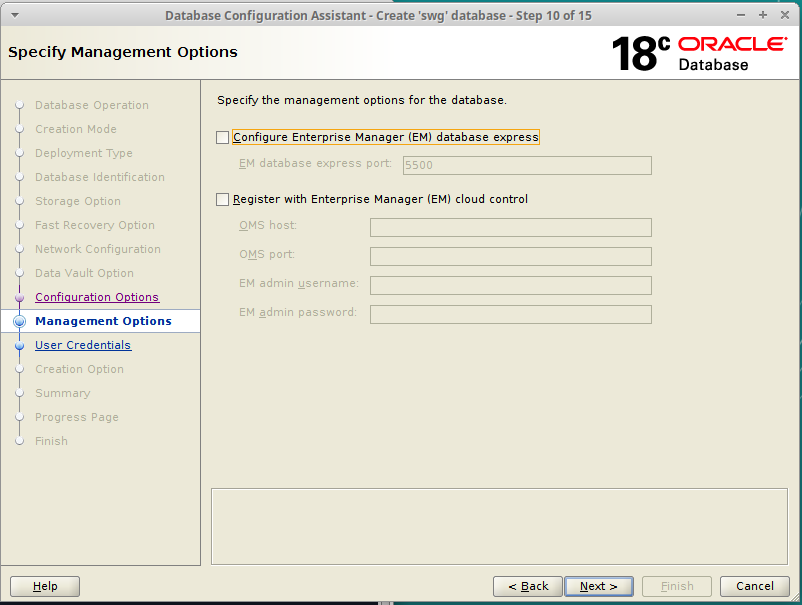

## Build a New SWG Server

This guide will help you build a new SWG Server VM from scratch. I recommend following this guide's every detail at least once before attempting to build a server with different settings or anything.

### Prerequisites

You need to have [Oracle VirtualBox](https://www.virtualbox.org/) installed on your host machine before you begin.

You should also download the installation media for Linux Mint 19.3 from [here](https://www.linuxmint.com/edition.php?id=278). This guide uses Linux Mint Xfce because I like it.

### Prepare your VM for installation

In VirtualBox, Select `Machine -> New...`. You will be prompted with a window to begin creating your VM. Enter Expert Mode if you're not already there. Then give your VM a name, choose where it will be saved, and select `Type: Linux` and `Version: Ubuntu (64-bit)`. Choose how much RAM you will give your VM and be sure that you have the `Create a virtual hard disk now` option selected.


>A note on memory size: To run the _entire_ game, you will need at least 16 GB of RAM in your VM. If you don't have that much, just choose an amount as high as you can go while still leaving enough for the host to be comfortable running a SWG client. In this example, my host has only 12 GB of RAM, so I will give 8 GB to the VM and keep 4 GB for the host. Individual mileage may vary.

After clicking `Create`, you will get a window asking you for details about your Virtual Hard Disk. Defaults should be fine, except that you'll want to give your VM more than the default 10 GB of disk space. 100 GB should be plenty, and as long as you've got dynamic allocation selected, you don't even loose that space until you actually need to use it.


Click create, and your VM will show up in VirtualBox.

Before booting it up, we'll need to change a few more options. With your VM selected, click `Settings` to bring up the settings window.

+ For `System -> Processor -> Processor(s)`, give the VM pretty much as many CPUs as you can without bringing the slider into the red.
+ For `Display -> Screen -> Video Memory`, bring the slider all the way to 128 MB.
+ Select `Storage -> Storage Devices -> Controller: IDE -> Empty`. Select the Disk icon to the right of the dropdown menu under `Attributes -> Optical Drive`, select `Choose Virtual Optical Disk File...` and navigate to and open the Linux Mint Xfce iso file you downloaded earlier.
+ (Optional:) If you are running your VM from a solid-state drive, click on your vdi under `Storage Devices` and select the `Solid-state Drive` checkbox under `Attributes`.
+ For `Network -> Adapter 1 -> Attached to:`, select `Bridged Adapter`.

That's it for settings! Click `OK` to close the window.

With your VM still selected, click the big green arrow that says `Start`. The VM will boot and bring you to Linux Mint's desktop. Double click the `Install Linux Mint` icon to begin the installation.

The default language and keyboard layout are fine, so press `Continue` twice.

On the next page, select the checkbox to install extra stuff and click `Continue`.

On the next page, the default selection should be `Erase disk and install Linux Mint`. This is good, so click `Install Now`. A confirmation window will appear, so click `Continue`.

The `Where are you` screen will try to guess at where you are. If it's wrong, make a new selection manually. This is for localization settings, time zone, etc. When you're ready, click `Continue`.

Next is the `Who are you` screen. Input `swg` for everything and select `Log in automatically`. Click `Continue`.


The installer will run for a while now, so feel free to go make a sandwich or something. When it's done, it'll ask you to restart. Go ahead and click `Restart Now`. It'll ask you to remove the installation media then press ENTER. VirtualBox actually removes the installation media automatically, so just go ahead and press ENTER. After it finishes rebooting, you will arrive at a welcome page. Go ahead and uncheck the box that says `Show this dialog at startup` and close the window.

Before we start installing server software, we want to prevent the OS from locking up or turning off automatically. Go to `Start -> Settings -> Power Manager`. Click the `Display` tab, move all the sliders to `Never`, and then just turn off `Display power management`. Click `Close` when you're done.


We also want to install VirtualBox Guest Additions. In the VM window, select `Devices -> Insert Guest Additions CD image...`. The CD will be mounted and a file explorer should open automatically. In the file explorer, click `File -> Open in Terminal`. At the command line, run the following command: (Note: The sudo password is `swg`)

```
sudo ./VBoxLinuxAdditions.run
```

When the script finishes, close the terminal. Eject the Guest Additions CD by clicking the eject button beside the disk name under `Devices` in the file explorer, then close file explorer. You will now be able to maximize the VM window and the desktop will resize automatically. You should now reboot the VM by clicking the power icon in the start menu and selecting `Restart`.

<!-- TODO: If I stop using gdown.pl, I can remove this notice because the clock won't matter -->
>Check the clock on your desktop. If installing Guest Additions makes your clock incorrect, you shouldn't continue. The script that comes in the next step needs your clock to be cooperating. I had an issue while writing this guide where I had daylight savings set incorrectly on my host and then my time set manually for some reason. VirtualBox didn't like that at all. Anyways, just make sure your clock isn't screwed up. Hopefully it works for you without any hassle.

After rebooting, we want our server to have a static IP address. First, it's helpful to know what our current IP address is. Open a terminal and run this command:

```
ifconfig
```

You'll get an output that looks like this. Pay attention to the numbers that correspond with the ones circled in red. Yours will be different. Once you've noted this IP address, you may close the terminal.


Now, click the network icon (the ethernet jack) on the right side of the taskbar and click `Edit Connections...`. In the window that appears, select `Wired connection 1` and click the gear icon at the bottom of the window. Click on the tab called `IPv4 settings`. For the Method, select `Manual`. Then under addresses, click `Add`. For your address, enter an address that has the same first three numbers as the IP address you noted earlier, but substitute the fourth number for `250`. In the example, I started with the IP address `192.168.1.76`, so I will enter `192.168.1.250`. This should almost always be safely outside your DHCP address pool. If you press Tab when you're done, the Netmask will be populated automatically. If it doesn't, it should usually be `24`. The Gateway should be the IP address of your router. (If you're not sure, check for a sticker on your router or maybe the manual. You can also run `route -n` from a terminal.) For your DNS servers, enter `1.1.1.1,8.8.8.8,8.8.4.4`. Click `Save` when you're done and close the Network Connections window.


Now, click the network icon again and select `Disconnect`. Then click the icon again and select `Wired connection 1`. This will cause your machine to switch to the new address.

>As a sanity check, you can open a terminal and rerun the `ifconfig` command from earlier. You should see your new IP address in the place of your old one.

We should now add our static IP address to the hosts file. Open a terminal and enter this command:

```
sudo nano /etc/hosts
```

Remove `127.0.1.1` from the second line and replace it with your static IP Address.


Press `CTRL + X` to exit. At the prompt, press `y` to indicate that you want to save, and press enter to accept the same filename.

Now, we can install git using this command:

```
sudo apt install git -y
```

Next, we want to download the swg-prepare repository. This repository contains stuff you need to get your system ready.

```
git clone https://github.com/tekaohswg/swg-prepare.git ~/swg-prepare
```

Let's install Oracle Database 18. This command will run a script to get the system ready for installation, including downloading the Oracle Database software. This may take a little while depending on your internet connection.

```
sudo ~/swg-prepare/oinit.sh
```

Once the script has finished, we're ready to run the actual installer. (Note: When you're prompted for it, the password for oracle is `swg`.)

```
xhost +
su - oracle
/u01/app/oracle/product/18/dbhome_1/runInstaller
```

The graphical installer will load. A warning will appear to let you know that the operating system is not supported. Just click `yes` to continue.


We want the option `Set Up Software Only`. Selected that and click `Next` to continue.


The default options on the next two screens, `Single instance database installation` and `Enterprise Edition`, are suitable. You may just click `Next` to continue.

The default `Oracle base` and `Inventory Directory` are also good. Just click `Next` for these screens.

The `Operating System groups` are also fine at their defaults. Click `Next` again for this page.

Finally, you'll be presented with a summary screen. Everything should be good, so click `Install`.

The installer will run for several minutes. Finally, you'll be asked to run a couple of scripts to complete the installation.


_Without_ closing the window or clicking `OK`, open a **NEW** terminal (don't close the old one) and run the commands with `sudo`:

```
sudo /u01/app/oraInventory/orainstRoot.sh
sudo /u01/app/oracle/product/18/dbhome_1/root.sh
```

The second one will ask for input twice. Just press `Enter` both times to keep the defaults. Then, close the terminal you just opened and press `OK` on the window that opened up before. If everything went well, you'll get confirmation that the installation was successful. Click `Close` to finish the installer.


Back to the first terminal that has been open this whole time, run the following command to run another script. This is needed before trying to create our database.

```
/home/swg/swg-prepare/orelink.sh
```

Still in the same terminal, use this command to launch the Oracle Net Configuration Assistant.

```
netca
```

The default option is `Listener Configuration`. This is what we want, so click `Next`.

On the next window, the only available option is `Add`, so just click `Next`.

Up next, the default name `LISTENER` is good, so click `Next`.

Nothing to change this page either. Just click `Next`.

Standard port `1521` is good, so click `Next` again.

Leave the next option as `No` and press `Next`.

`Listener configuration complete!` Press `Next`. Then, press `Finish` to close this window.

Up next is the Database Configuration Assistant. Again in the same terminal run:

```
dbca
```

When the application launches, the default selection will be `Create a database`. That's exactly what we want, so click `Next`. We want to do the `Advanced configuration`, so select that option and click `Next`.


The next page has nothing we want to change, so click `Next` again.

Here is where we'll start changing settings. Set `Global database name` and `SID` to `swg`. Deselect `Create as Container database` and click `Next`.


The next four pages are fine, so click `Next` four more times.

When you get to the page with several tabs, we'll change a few things again. First, in the `Memory` tab, set your `SGA Size` to `3072` and your `PGA Size` to `1024`.


In the `Character sets` tab, change the `National character set` to `UTF8`. That's it here, so click `Next`.


Uncheck the `Enterprise Manager` option and click `Next`.



Select the option to use the same password for everything, and set this password to `swg`.


When you click `Next`, you'll get a warning that your password kind of sucks. That's fine, so click `Yes`.


On the next page, the default checkbox is `Create database`. That's good, so click `Next`.

Finally, you'll get your confirmation summary. Everything should be good, so click `Finish` to let the application create your database. This will take quite a while. You'll probably think it's stuck. It's not. Just give it lots of time. When it's finally done, click `Close`.

You can finally close the terminal window you've been using for the Oracle installation.

After setting up the database, it will already be running in the background. However, we'll also want Oracle Database to load automatically whenever the VM is booted up. We can make that happen by starting a fresh terminal and running the following command:

```
sudo ~/swg-prepare/oservice.sh
```

The last thing we have to do with Oracle is prepare it to be accessible by the SWG server. In a terminal, run the following command to open SQL Developer:

```
/u01/app/oracle/product/18/dbhome_1/sqldeveloper/sqldeveloper.sh
```

As SQL Developer loads, it will ask you if you want to import your preferences. Click `No`. After loading some more, it will ask you about reporting your usage to Oracle. Uncheck the box to opt out and click `OK`.

We want to add some new connections. Click the green plus icon on the left-hand side under `Connections`. First, enter these inputs and click `Save`.

```
Connection name: system@swg
Username: system
Password: swg
[x] Save Password
SID: swg
```


Create another connection with these inputs and click save again: (You won't actually use this connection as part of the tutorial, but you might find it nice to have later.)

```
Connection name: swg@swg
Username: swg
Password: swg
[x] Save Password
SID: swg
```


With both these connections created, close this window. Your two new connections will now appear on the list on the left-hand side. Double-click on `system@swg` to connect as `system`. Then, click on `File -> Open...` and in the file explorer, open the file `/home/swg/swg-prepare/swgusr.sql`. This will load a series of SQL statements into SQL Developer. Press `F5` to run the script, and click `OK` on the confirmation window to confirm that you want to use the `system@swg` connection.


After a moment, the script will be completed. You can now close SQL Developer.

Let's run a few commands to get your system ready to install SWG.

```
sudo ~/swg-prepare/swginit.sh
source /etc/profile.d/oracle.sh
source /etc/profile.d/java.sh
```

Now we have to get the swg-main directory from SWG Source.

```
git clone https://github.com/SWG-Source/swg-main.git ~/swg-main
```

Enter the swg-main folder.

```
cd ~/swg-main
```

Finally, at long last, run the command to download and compile the SWG server. This may take a couple of hours, depending on your hardware.

```
ant swg
```

That's it! Congratulations on building your SWG server from scratch! I knew you could do it.
